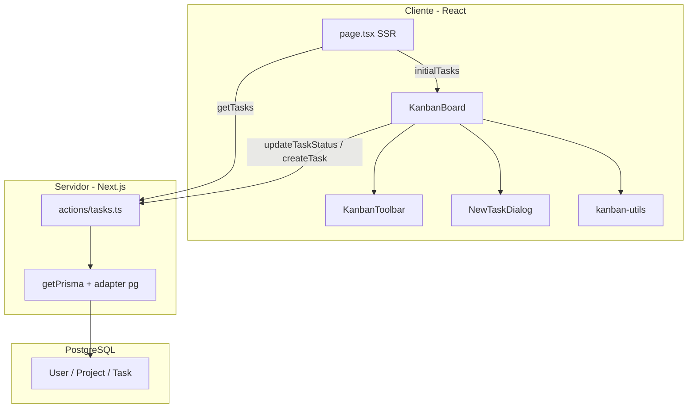

# Arquitectura — Mini-Jira

## Vista general

## Capas

### 1. Presentación (`src/components/kanban`)

- **`KanbanBoard`:** estado local (filtros), `useOptimistic`, `DndContext`, toasts.
- **`KanbanColumnBoard`:** zona droppable por estado.
- **`KanbanTaskCard`:** draggable con shadcn `Card`.
- **`KanbanToolbar` / `NewTaskDialog`:** filtros y alta de tareas.

### 2. Lógica de dominio (`src/lib/kanban`)

Funciones **puras** (testeables sin React):

- `filterTasks` — búsqueda + prioridad en cliente.
- `resolveTargetStatus` — columna destino al soltar (columna o tarjeta).
- `tasksReducer` — reducer para `useOptimistic`.
- `groupTasksByColumn` — agrupa tareas filtradas.
- `hasActiveKanbanFilters` — detecta filtros activos.

### 3. Validación (`src/lib/validations/task.ts`)

- Esquemas Zod compartidos entre **server actions** y **formulario** (`createTaskFormSchema`).
- Mensajes de error en español.

### 4. Datos (`src/app/actions/tasks.ts` + Prisma)

- **Prisma 7** con adaptador `@prisma/adapter-pg` y pool `pg`.
- `getPrisma()` devuelve `null` sin `DATABASE_URL` (permite build y modo mock).
- `ensureDemoProject()` inserta proyecto/usuarios/tareas demo en la primera carga.

### 5. Mapeo (`src/lib/tasks/map-kanban-task.ts`)

Convierte filas Prisma (con `assignedTo`) a `KanbanTask` serializable (`createdAt` como ISO string).

## Flujo: mover una tarjeta

1. Usuario suelta tarjeta → `handleDragEnd`.
2. `resolveTargetStatus` obtiene el nuevo `TaskStatus`.
3. `dispatchOptimistic` actualiza la UI al instante.
4. Si `dataSource === "database"`, `updateTaskStatus` persiste y `revalidatePath("/")`.
5. Toast de éxito o error; en error, `router.refresh()` reconcilia con el servidor.

## Flujo: crear tarea

1. Modal valida con `react-hook-form` + `createTaskFormSchema`.
2. Optimistic add con id temporal.
3. `createTask` en servidor → `revalidatePath` → refresh con id real.

## Decisiones técnicas

| Decisión | Motivo |
|----------|--------|
| App en subcarpeta `web/` | Mantener checklist y docs en la raíz del repo |
| Cliente Prisma en `src/generated/prisma` | Convención Prisma 7 |
| Filtros en cliente | Volumen bajo en MVP; evita round-trips por keystroke |
| `force-dynamic` en `/` | Datos siempre frescos desde BD |
| Sonner para feedback | Ligero, compatible con App Router |

## Seguridad (pendiente en producción)

- No hay autenticación: cualquier visitante ve/edita el proyecto demo.
- Para producción: añadir auth (NextAuth, Clerk, etc.), validar `projectId` por usuario y RLS en Postgres.
